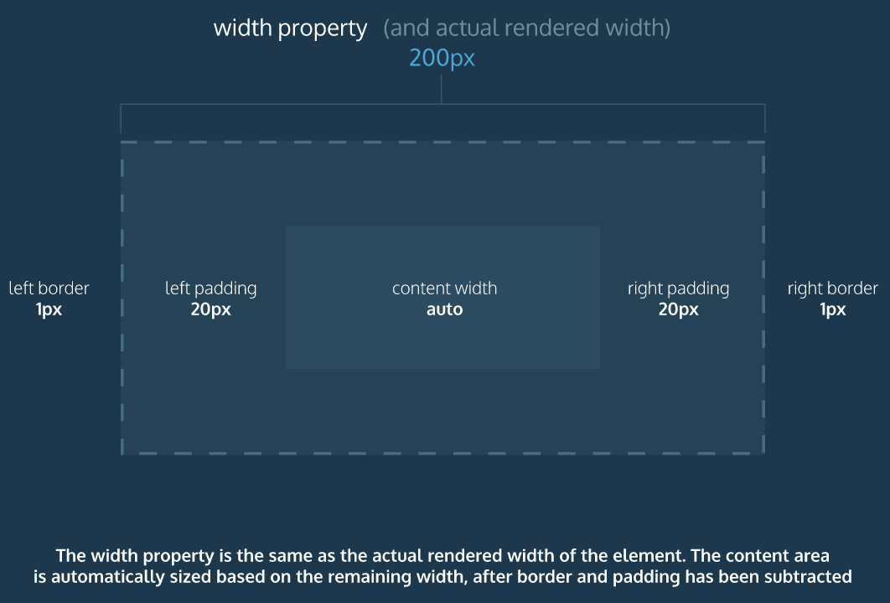

# Box Model

- The box model comprises a set of properties used to create space around and between HTML elements.
- The height and width of a content area can be set in pixels or percentage.
- Borders surround the content area and padding of an element. The color, style, and thickness of a border can be set with CSS properties.
- Padding is the space between the content area and the border. It can be set in pixels or percent.
- Margin is the amount of spacing outside of an element’s border.
- Horizontal margins add, so the total space between the borders of adjacent elements is equal to the sum of the right margin of one element and the left margin of the adjacent element.
- Vertical margins collapse, so the space between vertically adjacent elements is equal to the larger margin.
- margin: 0 auto horizontally centers an element inside of its parent content area, if it has a width.
- The overflow property can be set to display, hide, or scroll, and dictates how HTML will render content that overflows its parent’s content area.
- The visibility property can hide or show elements.


Box model is composed of the following:
- height
- width
- padding
- border
- margin
- overflow

# Box Model: Context-Sizing

```
<h1>Hello World</h1>

h1 {
  border: 1px solid black;
  height: 200px;
  width: 300px;
  padding: 10px;
}
```

In the example above, a heading element’s box has solid, black, 1 pixel thick borders. The height of the box is 200 pixels, while the width of the box is 300 pixels. A padding of 10 pixels has also been set on all four sides of the box’s content.

Unfortunately, under the current box model, the border thickness and the padding will affect the dimensions of the box.

The 10 pixels of padding increases the height of the box to 220 pixels and the width to 320 pixels. Next, the 1-pixel thick border increases the height to 222 pixels and the width to 322 pixels.

Under this box model, the border thickness and padding are added to the overall dimensions of the box. This makes it difficult to accurately size a box. Over time, this can also make all of a web page’s content difficult to position and manage.

# Box Model: Border-Box

The height and width in the border box will adjust to padding/border size and stay the same.

```
* {
  box-sizing: border-box;
}
```



# Display and Positioning

A browser will render the elements of an HTML document that has no CSS from left to right, top to bottom, in the same order as they exist in the document. This is called the flow of elements in HTML.

CSS includes properties that change how a browser positions elements. These properties specify where an element is located on a page, if the element can share lines with other elements, and other related attributes.

In this lesson, you will learn five properties for adjusting the position of HTML elements in the browser:

- position
- display
- z-index
- float
- clear

Notice the block-level elements in the image above take up their own line of space and therefore don’t overlap each other. In the browser to the right you can see block-level elements also consistently appear on the left side of the browser. This is the default position for block-level elements.

The default position of an element can be changed by setting its position property. The position property can take one of four values:

- static - the default value (it does not need to be specified)
- relative
- absolute
- fixed
